 

&nbsp;
&nbsp;
&nbsp;

---

<!-- 🎮 PLAYER CARD -->

## 🎮 Player Card

---

<!-- ⚔️ SKILL TREE -->

## ⚔️ Skill Tree

  

 

---

<!-- 🏆 ACHIEVEMENTS -->

## 🏆 Achievement Log

---

<!-- 📊 BATTLE STATS -->

## 📊 Battle Stats

<picture>
  <source media="(prefers-color-scheme: dark)" srcset="https://github-readme-stats.vercel.app/api?username=SifatIbna&show_icons=true&hide_border=true&bg_color=00000000&title_color=58a6ff&icon_color=1f6feb&text_color=c9d1d9&count_private=true&include_all_commits=true&rank_icon=github"/>
  
</picture>
<picture>
  <source media="(prefers-color-scheme: dark)" srcset="https://github-readme-streak-stats.herokuapp.com/?user=SifatIbna&hide_border=true&background=00000000&stroke=1f6feb&ring=58a6ff&fire=58a6ff&currStreakLabel=58a6ff&sideLabels=c9d1d9&dates=8b949e&currStreakNum=c9d1d9&sideNums=c9d1d9"/>
  
</picture>

 

<picture>
  <source media="(prefers-color-scheme: dark)" srcset="https://github-readme-stats.vercel.app/api/top-langs/?username=SifatIbna&layout=compact&hide_border=true&bg_color=00000000&title_color=58a6ff&text_color=c9d1d9&hide=Jupyter%20Notebook,tex&langs_count=8"/>
  
</picture>

---

<!-- 🐍 SNAKE -->

## 🐍 Contribution Snake

<picture>
  <source media="(prefers-color-scheme: dark)" srcset="https://raw.githubusercontent.com/SifatIbna/SifatIbna/output/github-contribution-grid-snake-dark.svg"/>
  <source media="(prefers-color-scheme: light)" srcset="https://raw.githubusercontent.com/SifatIbna/SifatIbna/output/github-contribution-grid-snake.svg"/>
  
</picture>

---

<!-- 📈 ACTIVITY -->

## 📈 Activity Graph

<picture>
  <source media="(prefers-color-scheme: dark)" srcset="https://github-readme-activity-graph.vercel.app/graph?username=SifatIbna&theme=react-dark&hide_border=true&bg_color=00000000&color=58a6ff&line=1f6feb&point=58a6ff&area=true&area_color=1f6feb"/>
  
</picture>

---

<!-- 🏅 TROPHIES -->

## 🏅 Trophy Case

<picture>
  <source media="(prefers-color-scheme: dark)" srcset="https://github-profile-trophy.vercel.app/?username=SifatIbna&theme=darkhub&no-frame=true&no-bg=true&column=7"/>
  
</picture>

---

<!-- 🎮 CONNECT -->

### 🎮 Want to team up?

&nbsp;

&nbsp;

  

