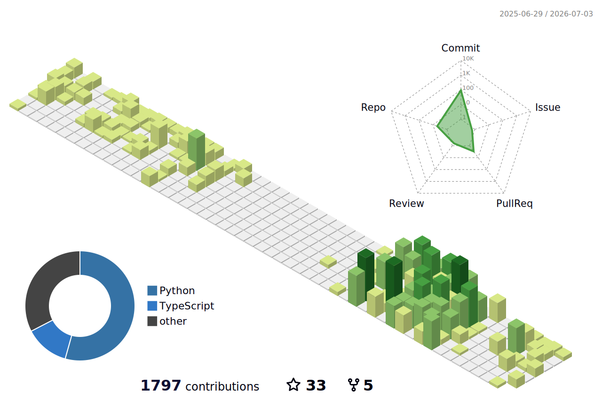

<!-- Custom animated header — constellation network background -->
<div align="center">
  
</div>

<div align="center">

<a href="https://www.linkedin.com/in/sifatibnaamin9"></a>&nbsp;
<a href="https://sifat-portflio.netlify.app/"></a>&nbsp;
<a href="mailto:sifatibna.amin9@gmail.com"></a>&nbsp;
<a href="https://github.com/SifatIbna"></a>

</div>

---

## Hey there 👋

I'm **Sifat** — a **polyglot programmer** who thinks in systems and writes in whatever language the problem demands. Python on Monday, TypeScript on Tuesday, Java when it gets serious, C++ when it gets critical.

I'm currently a **Senior Software Engineer** at **Intelligent Machines**, where I build AI-driven platforms and cloud-native systems that actually matter in production. Over 4+ years, I've shipped software serving **thousands of users across Asia** — from blockchain payment gateways handling enterprise transactions across Japan, China, and Korea, to AI-powered Co-Learning platforms that reshape how people learn together.

I graduated from **BUET** (Bangladesh University of Engineering and Technology), and I've been obsessed with one question ever since: *how do you build systems that are smart, trustworthy, and can handle real scale?*

> *"I think in systems, write in multiple languages, and believe the best code is the code that scales itself."*

<!-- Player profile card -->
<div align="center">
  
</div>

---

## 🔨 What I Build

<div align="center">
  
</div>

---

## 🚀 Featured Projects

<div align="center">
  
</div>

---

## ⚔️ Tech Arsenal

The tools I reach for daily — all battle-tested in production:

<div align="center">
  
</div>

---

## 🏆 Achievements Unlocked

Real numbers from real production systems:

| | Achievement | Impact | Context |
|---|---|---|---|
| 🏅 | **4,500+ Companies Served** | Enterprise scale | Blockchain payment gateway across East Asia |
| 🏅 | **1M+ Daily Transactions** | Pipeline mastery | Apache Airflow ETL with automated quality checks |
| ⚡ | **99.9% Cluster Uptime** | Reliability | MicroK8s 3-node HA with automated failover |
| ⚡ | **80% Faster Deployments** | DevOps velocity | Jenkins + ArgoCD GitOps CI/CD |
| ⚡ | **70% Faster Queries** | Performance | PostgreSQL indexing & partitioning |
| 🎯 | **95% Test Coverage** | Code quality | Jest + Cypress testing strategy |
| 🎯 | **95% Detection Accuracy** | AI precision | YOLOv5 computer vision retail analytics |
| 🎯 | **60% User Growth** | Product impact | Visual script language builder |
| ✨ | **90% Less Manual Reporting** | Automation | Python + SQL report generation |

---

## 📊 GitHub Stats

<div align="center">

<picture>
  <source media="(prefers-color-scheme: dark)" srcset="https://github-readme-stats.vercel.app/api?username=SifatIbna&show_icons=true&hide_border=true&bg_color=00000000&title_color=58a6ff&icon_color=1f6feb&text_color=c9d1d9&count_private=true&include_all_commits=true&rank_icon=github"/>
  
</picture>
<picture>
  <source media="(prefers-color-scheme: dark)" srcset="https://github-readme-streak-stats.herokuapp.com/?user=SifatIbna&hide_border=true&background=00000000&stroke=1f6feb&ring=58a6ff&fire=58a6ff&currStreakLabel=58a6ff&sideLabels=c9d1d9&dates=8b949e&currStreakNum=c9d1d9&sideNums=c9d1d9"/>
  
</picture>

<br/>

<picture>
  <source media="(prefers-color-scheme: dark)" srcset="https://github-readme-stats.vercel.app/api/top-langs/?username=SifatIbna&layout=compact&hide_border=true&bg_color=00000000&title_color=58a6ff&text_color=c9d1d9&hide=Jupyter%20Notebook,tex&langs_count=8"/>
  
</picture>

</div>

---

## 🚀 Space Shooter

<!-- Generated by: https://github.com/czl9707/gh-space-shooter -->
<div align="center">
  
</div>

<details>
<summary>⚙️ Setup: gh-space-shooter GitHub Action</summary>

Create `.github/workflows/space-shooter.yml` in your profile repo:

```yaml
name: Update Space Shooter Game

on:
  schedule:
    - cron: '0 0 * * *'   # Daily at midnight UTC
  workflow_dispatch:

permissions:
  contents: write

jobs:
  update-game:
    runs-on: ubuntu-latest
    steps:
      - uses: actions/checkout@v4
      - uses: czl9707/gh-space-shooter@v2
        with:
          github-token: ${{ secrets.GITHUB_TOKEN }}
          output-path: 'game.gif'
          strategy: 'random'
```

Then go to **Actions** → **Update Space Shooter Game** → **Run workflow** to generate it the first time.

</details>

---

## 📈 3D Contribution Calendar

<!-- Generated by: https://github.com/yoshi389111/github-profile-3d-contrib -->
<div align="center">
<picture>
  <source media="(prefers-color-scheme: dark)" srcset="./profile-3d-contrib/profile-night-rainbow.svg"/>
  <source media="(prefers-color-scheme: light)" srcset="./profile-3d-contrib/profile-green-animate.svg"/>
  
</picture>
</div>

<details>
<summary>⚙️ Setup: github-profile-3d-contrib GitHub Action</summary>

Create `.github/workflows/profile-3d.yml` in your profile repo:

```yaml
name: GitHub-Profile-3D-Contrib

on:
  schedule:
    - cron: "0 18 * * *"
  workflow_dispatch:

permissions:
  contents: write

jobs:
  build:
    runs-on: ubuntu-latest
    name: generate-github-profile-3d-contrib
    steps:
      - uses: actions/checkout@v5
      - uses: yoshi389111/github-profile-3d-contrib@latest
        env:
          GITHUB_TOKEN: ${{ secrets.GITHUB_TOKEN }}
          USERNAME: SifatIbna
      - name: Commit & Push
        run: |
          git config user.name github-actions
          git config user.email github-actions@github.com
          git add -A .
          if git commit -m "generated 3d contrib"; then
            git push
          fi
```

Then go to **Actions** → **GitHub-Profile-3D-Contrib** → **Run workflow** to generate it the first time. SVGs will appear in `./profile-3d-contrib/`.

</details>

---

## 🏅 Trophy Case

<div align="center">
<picture>
  <source media="(prefers-color-scheme: dark)" srcset="https://github-profile-trophy.vercel.app/?username=SifatIbna&theme=darkhub&no-frame=true&no-bg=true&column=7"/>
  
</picture>
</div>

---

## 🤝 Let's Build Something Together

I'm always up for interesting conversations about systems design, AI architectures, or just geeking out over a well-optimized query. If you're building something ambitious — let's talk.

<div align="center">

<a href="https://www.linkedin.com/in/sifatibnaamin9"></a>
&nbsp;
<a href="mailto:sifatibna.amin9@gmail.com"></a>
&nbsp;
<a href="https://sifat-portflio.netlify.app/"></a>

<br/><br/>


</div>


